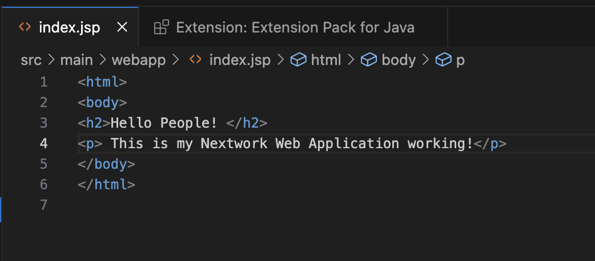
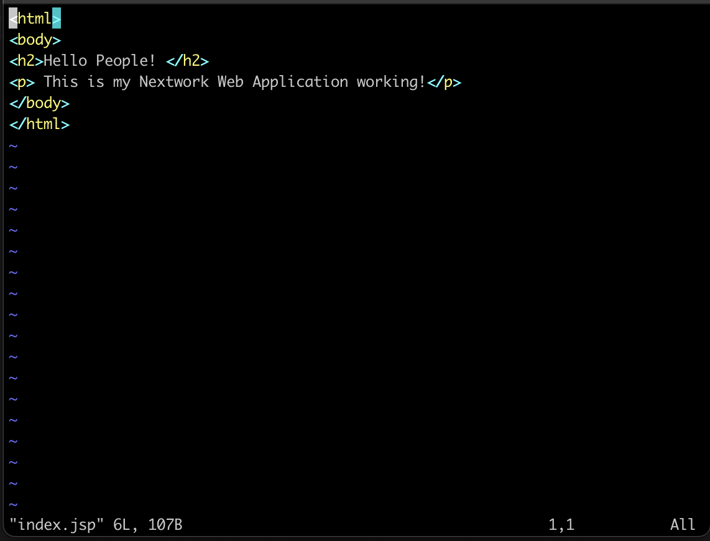

# Set Up a Web App in the Cloud

**Project Link:** [View Project](http://learn.nextwork.org/projects/aws-devops-vscode)

**Author:** Aleemuddin Mohammad  
**Email:** 2747aleem@gmail.com

---

---

## Introducing Today's Project!

### What is VSCode and why is it useful?

I have used VSCode today by connecting it to the remote SSH EC2 server, edit the index file of the java app. 

### How I'm using VSCode in this project

I have used VSCode today by connecting it to the remote SSH EC2 server, edit the index file of the java app. 

### One thing I didn't expect...

I didn't think I have to connect the VSCode sepearately even after connecting my terminal remotely. 

### This project took me...

This project took me around 40-45 minutes.

---

## Launching an EC2 instance

 I started this project by launching an EC2 instance because we need to set up a home for your web app's files.

### I also enabled SSH

SSH is a protocol used to make sure only authorized users can access a remote server.  I enabled SSH so that when I connect to my EC2 instance later in this project, SSH verifies I have the correct private key that matches the public key of the EC2.

### Key pairs

A key pair in EC2 is like the keys to your virtual computer. Just like you need a key to unlock and start your car, a key pair lets you securely access your EC2 instance.

Once I set up my key pair, AWS automatically downloaded private key .pem file.

---

## Set up VSCode

VSCode is one of the most popular tools for creating and managing coding projects. You'll often hear people call VSCode an IDE, which means software that help you write and edit code. 

I installed VSCode to connect with my instance, so I can create and edit my web app's code.

---

## My first terminal commands

A terminal is A terminal is where you send instructions to your computer using text instead of clicks. The first command I ran for this project is cd ~/Desktop/AWS/DevOps

I also updated my private key's permissions by running the command: chmod 400 nextwork-keypair.pem

---

## SSH connection to EC2 instance

To connect to my EC2 instance, I ran the command:ssh -i "nextwork-keypair.pem" ec2-user@ec2-3-15-147-221.us-east-2.compute.amazonaws.com

### This command required an IPv4 address

A server's DNS  is the public address for your EC2 server that the internet uses to find and connect to it. The local computer you're using to do this project will find and connect to your EC2 instance through IPv4 DNS.

---

## Maven & Java

Apache Maven is a tool that helps developers build and organize Java software projects. It's also a package manager, which means it automatically download any external pieces of code your project depends on to work.

Maven is required in this project because it's really useful for kick-starting web projects! It uses something called archetypes, which are like templates, to lay out the foundations for different types of projects e.g. web apps.

Java is a popular programming language used to build different types of applications, from mobile apps to large enterprise systems.

Java is required in this project because Maven is a tool that needs Java to operate. So if we don't install Java, we won't be able to use Maven to generate/build our web app today.

---

## Create the Application

I generated a Java web app using the command mvn archetype:generate \
   -DgroupId=com.nextwork.app \
   -DartifactId=nextwork-web-project \
   -DarchetypeArtifactId=maven-archetype-webapp \
   -DinteractiveMode=false

I installed Remote - SSH, which lets VScode connect directly via SSH to another computer securely over the internet. This lets me use VSCode to work on files or run programs on that server as if you were doing it on your own.

Configuration details required to set up a remote connection include Host, Hostname, IdentifyFile, User. 

---

## Create the Application

Using VSCode's file explorer, I could see pom.xml file along with src/main folder in which there are two dub directories: resources and webapp 

The (source) folder holds all the source code files that define how your web app looks and works.src is further divided into , which are the web app's files. 

---

## Using Remote - SSH

index.jsp is a file used in Java web apps. It's similar to an HTML file because it contains markup to display web pages.

I edited index.jsp by modifying the <h2> tag and adding a sentence by adding a 
 tag

---

## Using nano

An alternative to using IDEs is by accessing the index.jsp from the terminal. To edit index.jsp, I ran the command nano index.jsp or vi index.jsp

Compared to using an IDE, editing index.jsp in the terminal felt more complex. I'd be more likely to use an IDE if there is an option.

---

---
